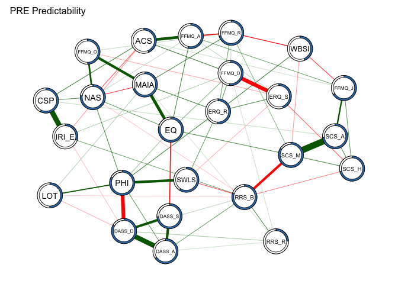

Fisrt steps
===========

packages

Creating the dataset to work in R. We include only the columns of the
variables with which we want to make a network.

los colores elegidos para los nodos es (“\#eee361”, “\#6fb3e4”,
“\#469b77”, “\#d16d6f”, “\#bbb2d4”)

Spearman with bonferroni correction
-----------------------------------

We are to plot Spearman Correlation Matrix:

``` r
pre_cor_matrix_spearman <- cor(network_pre, method="spearman")
post_cor_matrix_spearman <- cor(network_post, method = "spearman")

par(mfrow=c(1,2))
g_pre_cor <-qgraph(pre_cor_matrix_spearman, layout="spring", 
                   vsize=5, details=T, nodeNames = longnames, 
                   legend=F, aspect=TRUE , edge.color='#33A1AE', 
                   title = "PRE network spearman", 
                   labels = longnames,threshold = "bonferroni", 
                   alpha = 0.05, sampleSize = nrow(network_pre))
g_post_cor <-qgraph(post_cor_matrix_spearman, layout="spring", 
                    vsize=5, details=T, nodeNames = longnames, 
                    legend=F, aspect=TRUE , edge.color='#33A1AE', 
                    title = "POST network spearman",  
                    labels = longnames,threshold = "bonferroni", 
                    alpha = 0.05, sampleSize = nrow(network_post))
```


Regularized Partial correlation network:
----------------------------------------

Lets try to compute lasso regularized gaussian graphical model:

visualizing:

``` r
par(mfrow=c(3,2))
network_pre_GGM_plot<-plot(network_pre_GGM, layout="spring", 
                           vsize=8, cut=0, border.width=1.5, border.color="black", 
                           nodeNames = longnames,legend=FALSE, tuning = 0.25, aspect=T, 
                           title = "PRE GGM")
network_post_GGM_plot<-plot(network_post_GGM, layout="spring", 
                            vsize=8, cut=0, border.width=1.5, border.color="black", 
                            nodeNames = longnames,legend=FALSE, tuning = 0.25, 
                            aspect=T, title = "POST GGM")
network_pre_GGM_plot<-plot(network_pre_GGM, layout="circle", vsize=8, cut=0, 
                           border.width=1.5, border.color="black", nodeNames = longnames,
                           legend=FALSE,tuning = 0.25, aspect=T, title = "PRE GGM")
network_post_GGM_plot<-plot(network_post_GGM, layout="circle", vsize=8, cut=0, 
                            border.width=1.5, border.color="black", 
                            nodeNames = longnames,legend=FALSE,tuning = 0.25, aspect=T, 
                            title = "POST GGM")

network_pre_GGM_plot<-plot(network_pre_GGM, layout="circular", vsize=8, cut=0, 
                           border.width=1.5, border.color="black", 
                           nodeNames = longnames,legend=T, groups=group_scales, 
                           tuning = 0.25,aspect=T, title = "PRE GGM", colors = c("#eee361", "#6fb3e4", "#469b77", "#d16d6f", "#bbb2d4"))
```

    ## Warning in qgraph::qgraph(wMat, labels = labels, directed = directed,
    ## parallelEdge = parallelEdge, : The following arguments are not documented
    ## and likely not arguments of qgraph and thus ignored: colors

``` r
network_post_GGM_plot<-plot(network_post_GGM, layout="circular", vsize=8, cut=0, 
                            border.width=1.5, border.color="black", 
                            nodeNames = longnames,legend=T,groups=group_scales,
                            tuning = 0.25, aspect=T, title = "POST GGM", colors = c("#eee361", "#6fb3e4", "#469b77", "#d16d6f", "#bbb2d4"))
```

    ## Warning in qgraph::qgraph(wMat, labels = labels, directed = directed,
    ## parallelEdge = parallelEdge, : The following arguments are not documented
    ## and likely not arguments of qgraph and thus ignored: colors


``` r
dev.copy(png,
         filename="img/network_GGM_plot.png", height=6000, width=4000, res = 300);
```

    ## quartz_off_screen 
    ##                 3

``` r
dev.off();
```

    ## quartz_off_screen 
    ##                 2

``` r
par(mfrow=c(1,2))
network_pre_glasso <- qgraph(pre_cor_matrix_spearman, sampleSize = nrow(network_pre),graph="glasso",nodeNames = longnames,legend=T,groups=group_scales,layout = "spring", vsize = 8, colors = c("#eee361", "#6fb3e4", "#469b77", "#d16d6f", "#bbb2d4"),legend.mode = "groups", GLratio = 1.7, title = "PRE cct", title.cex = 2)
```

    ## Warning in qgraph(pre_cor_matrix_spearman, sampleSize =
    ## nrow(network_pre), : The following arguments are not documented and likely
    ## not arguments of qgraph and thus ignored: colors

``` r
network_post_glasso <- qgraph(post_cor_matrix_spearman, sampleSize = nrow(network_post),graph="glasso",nodeNames = longnames,legend=T,groups=group_scales,layout = "spring", vsize = 8, colors = c("#eee361", "#6fb3e4", "#469b77", "#d16d6f", "#bbb2d4"), legend.mode = "groups", GLratio = 1.7, title = "POST cct", title.cex = 2)
```

    ## Warning in qgraph(post_cor_matrix_spearman, sampleSize =
    ## nrow(network_post), : The following arguments are not documented and likely
    ## not arguments of qgraph and thus ignored: colors


``` r
dev.copy(png,
         filename="img/network_GGM_plot.png", height=2000, width=6000, res = 300);
```

    ## quartz_off_screen 
    ##                 3

``` r
dev.off();
```

    ## quartz_off_screen 
    ##                 2

PCA
---

``` r
fa.parallel(network_pre)
```


    ## Parallel analysis suggests that the number of factors =  4  and the number of components =  2

``` r
vss(network_pre)
```

    ## The estimated weights for the factor scores are probably incorrect.  Try a different factor extraction method.
    ## The estimated weights for the factor scores are probably incorrect.  Try a different factor extraction method.

    ## Warning in fac(r = r, nfactors = nfactors, n.obs = n.obs, rotate =
    ## rotate, : An ultra-Heywood case was detected. Examine the results carefully

    ## The estimated weights for the factor scores are probably incorrect.  Try a different factor extraction method.


    ## 
    ## Very Simple Structure
    ## Call: vss(x = network_pre)
    ## VSS complexity 1 achieves a maximimum of 0.89  with  1  factors
    ## VSS complexity 2 achieves a maximimum of 0.92  with  2  factors
    ## 
    ## The Velicer MAP achieves a minimum of 0.03  with  4  factors 
    ## BIC achieves a minimum of  -612.8  with  3  factors
    ## Sample Size adjusted BIC achieves a minimum of  -31.82  with  8  factors
    ## 
    ## Statistics by number of factors 
    ##   vss1 vss2   map dof chisq    prob sqresid  fit RMSEA  BIC SABIC complex
    ## 1 0.89 0.00 0.034 275   686 5.6e-37    14.9 0.89 0.137 -570   299     1.0
    ## 2 0.56 0.92 0.031 251   535 1.3e-22    11.1 0.92 0.121 -611   182     1.5
    ## 3 0.55 0.89 0.029 228   428 2.4e-14     8.4 0.94 0.109 -613   107     1.6
    ## 4 0.39 0.77 0.028 206   335 3.1e-08     6.5 0.95 0.095 -605    45     2.1
    ## 5 0.38 0.71 0.032 185   272 3.3e-05     5.4 0.96 0.085 -573    12     2.2
    ## 6 0.34 0.68 0.034 165   221 2.2e-03     4.2 0.97 0.077 -532   -11     2.3
    ## 7 0.33 0.67 0.032 146   176 4.6e-02     3.2 0.98 0.066 -491   -30     2.4
    ## 8 0.36 0.69 0.036 128   148 1.1e-01     2.7 0.98 0.062 -436   -32     2.5
    ##   eChisq  SRMR eCRMS eBIC
    ## 1    537 0.097 0.101 -719
    ## 2    333 0.076 0.083 -813
    ## 3    213 0.061 0.070 -828
    ## 4    134 0.048 0.058 -807
    ## 5     97 0.041 0.052 -747
    ## 6     64 0.033 0.045 -689
    ## 7     37 0.025 0.037 -629
    ## 8     26 0.021 0.032 -559

``` r
library("psych") 
PCA_pre <- principal(cor(network_pre), nfactors = 2) 
qgraph(cor(network_pre), 
       layout=PCA_pre$loadings, 
       groups = group_scales,
       colors = c("#eee361", "#6fb3e4", "#469b77", "#d16d6f", "#bbb2d4"),
       title="PCA cct PRE",
       borders=FALSE, 
       vsize=4.5, palette = 'pastel',fade=T,
       rotation="promax",vTrans=210,
       posCol = ("#457B9D"),negCol=("#E63946"),
       minimum=0.1, curveAll=T)
```

    ## Warning in qgraph(cor(network_pre), layout = PCA_pre$loadings, groups =
    ## group_scales, : The following arguments are not documented and likely not
    ## arguments of qgraph and thus ignored: colors


``` r
dev.copy(png,
         filename="img/PCA_pre.png", height=3000, width=3000, res = 200);
```

    ## quartz_off_screen 
    ##                 3

``` r
dev.off();
```

    ## quartz_off_screen 
    ##                 2

``` r
library("psych") 
PCA_post <- principal(cor(network_post), nfactors = 2) 
qgraph(cor(network_post), 
       layout=PCA_post$loadings, 
       groups = group_scales, 
       title="PCA cct PRE",
       borders=FALSE,
       colors = c("#eee361", "#6fb3e4", "#469b77", "#d16d6f", "#bbb2d4"),
       vsize=4.5, palette = 'pastel',fade=T,
       rotation="promax",vTrans=210,
       posCol = ("#457B9D"),negCol=("#E63946"),
       minimum=0.1, curveAll=T)
```

    ## Warning in qgraph(cor(network_post), layout = PCA_post$loadings, groups =
    ## group_scales, : The following arguments are not documented and likely not
    ## arguments of qgraph and thus ignored: colors


``` r
dev.copy(png,
         filename="img/PCA_post.png", height=3000, width=3000, res = 200);
```

    ## quartz_off_screen 
    ##                 3

``` r
dev.off();
```

    ## quartz_off_screen 
    ##                 2

visualizing:
------------

``` r
par(mfrow=c(1,2))
set.seed(2018)
network_pre_GGM_plot<-plot(network_pre_GGM, layout="spring",
                           vsize=6, cut=0, border.width=1.5, 
                           border.color="black", 
                           nodeNames = longnames,legend=FALSE, 
                           aspect=T, tuning = 0.25, title = "PRE GGM")
network_post_GGM_plot<-plot(network_post_GGM, 
                            layout="spring", vsize=6, cut=0, 
                            border.width=1.5, border.color="black", 
                            nodeNames = longnames,
                            legend=FALSE, aspect=T, tuning = 0.25, title = "POST GGM")
```


``` r
dev.copy(png,
         filename="img/network_GGM_plot2.png", height=6000, width=6000, res = 300);
```

    ## quartz_off_screen 
    ##                 3

``` r
dev.off();
```

    ## quartz_off_screen 
    ##                 2

Comparison of Networks
======================

We use networkcomparisontest using @VanBorkulo2018

Ploting the results:

``` r
par(mfrow=c(1,2))
plot(cct_comparison, what="network") 
plot(cct_comparison, what="strength")
```


We can create a object of adjacency Matrix:

``` r
network_pre_adjacencyMatrix <- network_pre_GGM$graph
network_post_adjacencyMatrix <- network_post_GGM$graph
```

Heat plot for pre:
------------------

``` r
heatmap.2(network_pre_adjacencyMatrix,
        main="Network PRE Adjacency Matrix", 
        trace="none",
        col = viridis(24),
        scale="none")
```


Heat plot for post:
-------------------

``` r
heatmap.2(network_post_adjacencyMatrix, 
        main="Network POST Adjacency Matrix", 
        trace="none",
        col = viridis(24),
        scale="none")
```


Centrality analysis
===================

Node strength for pre
---------------------

Para calcular el degree, tengo que convertir mi grafo en binario:

``` r
network_pre_bin <- as.matrix((network_pre_adjacencyMatrix > 0) + 0)
centRes_pre_bin <- centrality(network_pre_bin)
```

``` r
centRes_pre <- centrality(network_pre_GGM)
#write.csv(centRes_pre, file = "centRes_pre_outdegree.csv")
#extraigo el grafo y lo transormo en binario

# Node strength (degree):
centRes_pre$OutDegree # Or InDegree, it's the same in unweighted networks
```

    ##    FFMQ_O    FFMQ_D    FFMQ_A    FFMQ_J    FFMQ_R       NAS        EQ 
    ## 0.7067530 0.9203354 0.7988929 0.9913424 1.0724573 1.1171061 1.2763170 
    ##      MAIA     SCS_A     SCS_H     SCS_M       CSP     IRI_E      SWLS 
    ## 1.0525293 0.8974191 0.9879520 1.2777139 0.9810011 0.5225627 0.7598352 
    ##       LOT       PHI    DASS_S    DASS_D    DASS_A      WBSI     RRS_B 
    ## 0.6441713 1.3087251 0.9454703 1.2605866 0.7324505 0.6561664 1.2584574 
    ##     RRS_R     ERQ_R     ERQ_S       ACS 
    ## 0.5115995 0.6309823 0.6164416 0.4689637

``` r
# Closeness:
centRes_pre$Closeness
```

    ##      FFMQ_O      FFMQ_D      FFMQ_A      FFMQ_J      FFMQ_R         NAS 
    ## 0.003118299 0.002903591 0.002965806 0.002863602 0.002830869 0.003416409 
    ##          EQ        MAIA       SCS_A       SCS_H       SCS_M         CSP 
    ## 0.003908185 0.003331489 0.003083208 0.002848624 0.003501769 0.002582791 
    ##       IRI_E        SWLS         LOT         PHI      DASS_S      DASS_D 
    ## 0.002427127 0.002875306 0.002542387 0.003261890 0.003266852 0.003106105 
    ##      DASS_A        WBSI       RRS_B       RRS_R       ERQ_R       ERQ_S 
    ## 0.002901103 0.002533062 0.003461237 0.002651385 0.002713190 0.002606054 
    ##         ACS 
    ## 0.002523905

``` r
write.csv(centRes_pre$Closeness, file = "centRes_pre$Closeness.csv")
```

``` r
# Betweenness:
centRes_pre$Betweenness
```

    ## FFMQ_O FFMQ_D FFMQ_A FFMQ_J FFMQ_R    NAS     EQ   MAIA  SCS_A  SCS_H 
    ##     18     32     42     22     12     44    146     42     14     12 
    ##  SCS_M    CSP  IRI_E   SWLS    LOT    PHI DASS_S DASS_D DASS_A   WBSI 
    ##     76     26     10      8      0     72     38     30      0      4 
    ##  RRS_B  RRS_R  ERQ_R  ERQ_S    ACS 
    ##     80      2      6      8     10

``` r
write.csv(centRes_pre$Betweenness, file = "centRes_pre$Betweenness.csv")
```

``` r
# Expected Influence:
centRes_pre$InExpectedInfluence
```

    ##     FFMQ_O     FFMQ_D     FFMQ_A     FFMQ_J     FFMQ_R        NAS 
    ##  0.5257232  0.3222810  0.6667473  0.6119078  0.6788332  0.6322783 
    ##         EQ       MAIA      SCS_A      SCS_H      SCS_M        CSP 
    ##  0.8363844  1.0469382  0.8974191  0.4995606  0.5830182  0.7491145 
    ##      IRI_E       SWLS        LOT        PHI     DASS_S     DASS_D 
    ##  0.4614557  0.3181185  0.1818556  0.7888418  0.3545774  0.1699165 
    ##     DASS_A       WBSI      RRS_B      RRS_R      ERQ_R      ERQ_S 
    ##  0.7324505 -0.3434779 -0.2327617  0.5115995  0.6309823 -0.5480557 
    ##        ACS 
    ##  0.4134648

``` r
write.csv(centRes_pre$Betweenness, file = "centRes_pre$expectedinfluence.csv")
```

ploting:

``` r
centralityPlot(network_pre_GGM, include = c("ExpectedInfluence","Strength", "Closeness", "Betweenness"), scale="raw")
```


comparing the regularization:

``` r
centralityPlot(GGM = list(Spearman = g_pre_cor, regularized = network_pre_GGM), include = c("ExpectedInfluence","Strength", "Closeness", "Betweenness"))
```

    ## Warning: Removed 1 rows containing missing values (geom_point).


Node strength for post
----------------------

Para calcular el degree, tengo que convertir mi grafo en binario:

``` r
network_post_bin <- as.matrix((network_post_adjacencyMatrix > 0) + 0)
centRes_post_bin <- centrality(network_post_bin)
```

``` r
centRes_post <- centrality(network_post_GGM)

# Node strength (degree):
centRes_post$OutDegree # Or InDegree, it's the same in unweighted networks
```

    ##    FFMQ_O    FFMQ_D    FFMQ_A    FFMQ_J    FFMQ_R       NAS        EQ 
    ## 0.5303548 0.6199885 0.8625400 0.9542007 0.6893053 1.0703965 1.2442966 
    ##      MAIA     SCS_A     SCS_H     SCS_M       CSP     IRI_E      SWLS 
    ## 1.1658797 0.9762972 1.0106334 1.2283150 1.0193127 0.2952861 0.7985258 
    ##       LOT       PHI    DASS_S    DASS_D    DASS_A      WBSI     RRS_B 
    ## 0.8061308 1.2968406 1.0825695 0.8130359 0.5967870 0.5357366 0.9278963 
    ##     RRS_R     ERQ_R     ERQ_S       ACS 
    ## 0.2417639 0.4776415 0.4773759 0.2689717

``` r
# Closeness:
centRes_post$Closeness
```

    ##      FFMQ_O      FFMQ_D      FFMQ_A      FFMQ_J      FFMQ_R         NAS 
    ## 0.002465505 0.002518828 0.002946663 0.002784207 0.002596104 0.003317832 
    ##          EQ        MAIA       SCS_A       SCS_H       SCS_M         CSP 
    ## 0.003302650 0.002917579 0.003155643 0.002806350 0.003387742 0.002808164 
    ##       IRI_E        SWLS         LOT         PHI      DASS_S      DASS_D 
    ## 0.002304173 0.002722514 0.002590749 0.003015557 0.003160815 0.002935051 
    ##      DASS_A        WBSI       RRS_B       RRS_R       ERQ_R       ERQ_S 
    ## 0.002652779 0.002557442 0.003010754 0.001839689 0.002165333 0.002458892 
    ##         ACS 
    ## 0.002036735

``` r
write.csv(centRes_post$Closeness, file = "centRes_post$Closeness.csv")
```

``` r
# Betweenness:
centRes_post$Betweenness
```

    ## FFMQ_O FFMQ_D FFMQ_A FFMQ_J FFMQ_R    NAS     EQ   MAIA  SCS_A  SCS_H 
    ##      0     30     46     28      0     88    108     62     58     22 
    ##  SCS_M    CSP  IRI_E   SWLS    LOT    PHI DASS_S DASS_D DASS_A   WBSI 
    ##    114     78      0     14     10     58     80     50      0      8 
    ##  RRS_B  RRS_R  ERQ_R  ERQ_S    ACS 
    ##     36      0      4     10      4

``` r
write.csv(centRes_post$Betweenness, file = "centRes_post$Betweenness.csv")
```

``` r
# Expected Influence:
centRes_post$InExpectedInfluence
```

    ##     FFMQ_O     FFMQ_D     FFMQ_A     FFMQ_J     FFMQ_R        NAS 
    ##  0.5303548  0.3914163  0.3126979 -0.1504309  0.5543525  0.7745188 
    ##         EQ       MAIA      SCS_A      SCS_H      SCS_M        CSP 
    ##  0.9987033  1.1625816  0.9566813  0.5409566  1.0814295  0.2767132 
    ##      IRI_E       SWLS        LOT        PHI     DASS_S     DASS_D 
    ##  0.2952861  0.5541383  0.4424115  0.7921056  0.3456413 -0.1291219 
    ##     DASS_A       WBSI      RRS_B      RRS_R      ERQ_R      ERQ_S 
    ##  0.2990439 -0.5019782 -0.1713880  0.2228067  0.4776415 -0.4773759 
    ##        ACS 
    ##  0.1965903

``` r
write.csv(centRes_post$Betweenness, file = "centRes_post$ExpectedInfluence.csv")
```

ploting:

``` r
centralityPlot(network_post_GGM,include = c("ExpectedInfluence","Strength", "Closeness", "Betweenness"))
```

    FALSE Note: z-scores are shown on x-axis rather than raw centrality indices.


comparing the regularization:

``` r
centralityPlot(GGM = list(Spearman = g_post_cor, regularized = network_post_GGM),include = c("ExpectedInfluence","Strength", "Closeness", "Betweenness"))
```

    ## Warning: Removed 2 rows containing missing values (geom_point).


Centrality comparison plot standarised values
---------------------------------------------

``` r
centralityPlot(GGM = list(PRE = network_pre_GGM, POST = network_post_GGM),include = c("ExpectedInfluence","Strength", "Closeness", "Betweenness"))
```


Centrality comparison plot raw values
-------------------------------------

``` r
centralityPlot(GGM = list(PRE = network_pre_GGM, POST = network_post_GGM), scale = "raw", include = c("ExpectedInfluence","Strength", "Closeness", "Betweenness"))
```


Calculo de la eficiencia:
-------------------------

Lo primero es pasar de un gráfico de qgraph a otro de igraph, para ello:

``` r
network_pre_qgraph <- qgraph(pre_cor_matrix_spearman, sampleSize = nrow(network_pre), graph = "glasso")
```


``` r
network_post_qgraph <- qgraph(post_cor_matrix_spearman, sampleSize = nrow(network_pre), graph = "glasso")
```


``` r
network_pre_igraph <- as.igraph(network_pre_qgraph)
network_post_igraph <- as.igraph(network_post_qgraph)
```

Calculo del clustering coeficient:
----------------------------------

*Coeficiente de agrupamiento global*

El coeficiente de agrupamiento global se basa en tripletes de nodos. Un
triplete consta de tres nodos conectados. Por lo tanto, un triángulo
incluye tres tripletes cerrados, uno centrado en cada uno de los nodos
(nb esto significa que los tres tripletes en un triángulo provienen de
selecciones de nodos superpuestas). El coeficiente de agrupamiento
global es el número de tripletes cerrados (o 3 x triángulos) sobre el
número total de tripletes (tanto abiertos como cerrados). El primer
intento de medirlo fue realizado por Luce y Perry (1949). Esta medida
proporciona una indicación del agrupamiento en toda la red (global) y se
puede aplicar tanto a redes no dirigidas como a redes dirigidas.

*Coeficiente de agrupamiento local* Dado un vecindario de un nodo,
definido como el conjunto de conexiones inmediatas con otros nodos, se
computa el coeficiente de agrupación local como el número de conexiones
entre los nodos posibles dividido por el número de conexiones posibles,
la siguiente figura captura el concepto: 

Computando los coeficientes de clustering locales

``` r
clustering_pre <- transitivity(network_pre_igraph, type = "local")
clustering_post <- transitivity(network_post_igraph, type = "local")
#para calcular la eficiencia local utilizo el paquete brainGraph:
local.eff <- function(g) {
  if ('degree' %in% vertex_attr_names(g)) {
    degs <- V(g)$degree
  } else {
    degs <- degree(g)
  }
 
  eff <- numeric(length(degs))
  nodes <- which(degs > 1)
 
  eff[nodes] <- simplify2array(mclapply(nodes, function(x) {
    neighbs <- neighbors(g, v=x)
    g.sub <- induced.subgraph(g, neighbs)
    Nv <- vcount(g.sub)
   
    paths <- shortest.paths(g.sub, weights=NA)
    paths <- paths[upper.tri(paths)]
    2 / Nv / (Nv - 1) * sum(1 / paths[paths != 0])
    }, mc.cores=detectCores())
  )
eff
}
library("parallel")
efficiency_pre <- local.eff(network_pre_igraph)
efficiency_post <- local.eff(network_post_igraph)
```

\#\#Ploting with dimensions:

``` r
df_centrality <- data.frame(centRes_pre$InExpectedInfluence,
                            centRes_pre$InDegree,
                            centRes_pre_bin$InDegree,
                            clustering_pre,
                            efficiency_pre,
                            centRes_post$InExpectedInfluence,
                            centRes_post$InDegree,
                            centRes_post_bin$InDegree,
                            clustering_post,
                            efficiency_post)
df_centrality$Group <- grupos_titulos
df_centrality$Item <- longnames
df_centrality$index <- (1:25)
```

``` r
#vamos a reshape:
df_centrality_long<- reshape(data=df_centrality, idvar="Item", varying = c("centRes_pre.InExpectedInfluence", "centRes_pre.InDegree",
                                     "centRes_pre_bin.InDegree",
                                     "clustering_pre",
                                     "efficiency_pre",
                                     "centRes_post.InExpectedInfluence",
                                     "centRes_post.InDegree",
                                     "centRes_post_bin.InDegree",
                                     "clustering_post",
                                     "efficiency_post"), times = c("centRes_pre.InExpectedInfluence", "centRes_pre.InDegree",
                                     "centRes_pre_bin.InDegree",
                                     "clustering_pre",
                                     "efficiency_pre",
                                     "centRes_post.InExpectedInfluence",
                                     "centRes_post.InDegree",
                                     "centRes_post_bin.InDegree",
                                     "clustering_post",
                                     "efficiency_post"),
                         v.name=c("value"),
                         new.row.names = 1:10000,
                         direction="long")
df_centrality_long$state <- rep(c("PRE", "POST"), 1, each=125)
df_centrality_long$central_parameter <- rep(c("ExpectedInfluence", "Strength", "Degree", "Clustering", "Efficiency"), 2, each=25)
df_centrality_long$central_parameter_f <- factor (df_centrality_long$central_parameter, levels = c("ExpectedInfluence", "Strength", "Degree", "Clustering", "Efficiency"))
df_centrality_long$index_state <- rep(c(1:125), 2)
df_centrality_long$state <- as.factor(df_centrality_long$state)
df_centrality_long$central_parameter <- as.factor(df_centrality_long$central_parameter)
```

``` r
p1 <- ggplot(df_centrality_long, aes(x=index))
p1 <- p1 + geom_line(aes(y = value, color = state)) +geom_point(aes(y = value, color = state))
p1 <- p1 + ylab("") +xlab("") +  labs(color = "", fill= "Groups")
p1 <- p1 + facet_grid(central_parameter_f ~ ., scales="free")
p1 <- p1 + geom_rect(data=df_groups,aes(xmin=xmin,ymin=ymin,xmax=xmax,ymax=ymax,fill=names_groups), 
        alpha=0.3,inherit.aes=FALSE)+ 
    scale_fill_manual(breaks = c("Mindfulness","Compassion", 
"Psychologycal well-being", "Psychologycal distress", 
"Emotional and cognitive regulation"),
values=c("#6fb3e4", "#bbb2d4", "#eee361", "#d16d6f","#469b77"),
labels = c("Mindfulness","Compassion", 
"Psychologycal well-being", "Psychologycal distress", 
"Emotional and cognitive regulation"))
p1 <- p1 + scale_x_continuous(breaks = 1:25,label = longnames, limits = c(1,25))
p1 <- p1 + theme_bw() + theme(axis.text.x = element_text(angle = 45, hjust = 1), legend.position="bottom")
p1
```


``` r
dev.copy(png,
         filename="img/comparison_centrality_coefficients.png", height=3000, width=5000, res = 300);
```

    ## quartz_off_screen 
    ##                 3

``` r
dev.off();
```

    ## quartz_off_screen 
    ##                 2

Sobre la Expected influence:
----------------------------

Cuando una red contiene edges positivos y negativos, las medidas
tradicionales de centralidad, como la centralidad de la fuerza, pueden
no predecir con precisión la influencia de los nodos en la red.
Robinaugh, Millner y McNally (2016) mostraron que en estos casos, la
influencia esperada es una medida más apropiada. La influencia esperada
de un paso se define como la suma de todos los edges que se extienden
desde un nodo dado (donde se mantiene el signo de cada edge). La
influencia esperada de dos pasos, como su nombre indica, mide la
conectividad hasta dos edges del nodo. Se define como la suma de las
influencias esperadas (ponderadas) de cada nodo conectado al nodo
inicial más la influencia esperada de un paso del nodo inicial. Los
pesos se determinan por la resistencia de los bordes entre el nodo
inicial y cada nodo de “segundo paso”.
[Fuente](https://rdrr.io/cran/networktools/src/R/expectedInf.R)

Edge-weight accuracy
====================

Taking the work of @Epskamp2017 we can stimate the accuracy:

PRE cct network
---------------

``` r
pre_boot <- bootnet(network_pre_GGM, nBoots = 500,  nCores = 8)
```

    ## Note: bootnet will store only the following statistics:  edge, strength, outStrength, inStrength

    ## Estimating sample network...

    ## Estimating Network. Using package::function:
    ##   - qgraph::EBICglasso for EBIC model selection
    ##     - using glasso::glasso
    ##   - qgraph::cor_auto for correlation computation
    ##     - using lavaan::lavCor

    ## Bootstrapping...

    ## Computing statistics...

``` r
plot(pre_boot, labels = T, order = "sample")
```


``` r
dev.copy(png,
         filename="img/PRE_bootstraping_accuracy.png", height=8000, width=3000, res = 200);
```

    ## quartz_off_screen 
    ##                 3

``` r
dev.off();
```

    ## quartz_off_screen 
    ##                 2

``` r
plot(pre_boot, "edge", plot = "difference", onlyNonZero = TRUE, order = "sample")
```

    ## Expected significance level given number of bootstrap samples is approximately: 0.049


``` r
dev.copy(png,
         filename="img/PRE_bootstraping_difference.png", height=5000, width=6000, res = 200);
```

    ## quartz_off_screen 
    ##                 3

``` r
dev.off();
```

    ## quartz_off_screen 
    ##                 2

``` r
plot(pre_boot, "strength")
```

    ## Expected significance level given number of bootstrap samples is approximately: 0.05


``` r
dev.copy(png,
         filename="img/PRE_bootstraping_strength.png", height=5000, width=6000, res = 200);
```

    ## quartz_off_screen 
    ##                 3

``` r
dev.off();
```

    ## quartz_off_screen 
    ##                 2

POST cct network
----------------

``` r
post_boot <- bootnet(network_post_GGM, nBoots = 500,  nCores = 8)
```

    ## Note: bootnet will store only the following statistics:  edge, strength, outStrength, inStrength

    ## Estimating sample network...

    ## Estimating Network. Using package::function:
    ##   - qgraph::EBICglasso for EBIC model selection
    ##     - using glasso::glasso
    ##   - qgraph::cor_auto for correlation computation
    ##     - using lavaan::lavCor

    ## Bootstrapping...

    ## Computing statistics...

``` r
plot(post_boot, labels = TRUE, order = "sample")
```


``` r
dev.copy(png,
         filename="img/POST_bootstraping_accuracy.png", height=8000, width=3000, res = 200);
```

    ## quartz_off_screen 
    ##                 3

``` r
dev.off();
```

    ## quartz_off_screen 
    ##                 2

``` r
plot(post_boot, "edge", plot = "difference", onlyNonZero = TRUE, order = "sample")
```

    ## Expected significance level given number of bootstrap samples is approximately: 0.051


``` r
dev.copy(png,
         filename="img/POST_bootstraping_difference.png", height=5000, width=6000, res = 200);
```

    ## quartz_off_screen 
    ##                 3

``` r
dev.off();
```

    ## quartz_off_screen 
    ##                 2

``` r
plot(post_boot, "strength")
```

    ## Expected significance level given number of bootstrap samples is approximately: 0.05


``` r
dev.copy(png,
         filename="img/POST_bootstraping_strength.png", height=5000, width=6000, res = 200);
```

    ## quartz_off_screen 
    ##                 3

``` r
dev.off();
```

    ## quartz_off_screen 
    ##                 2

Centrality Stability
====================

PRE cct network
---------------

``` r
pre_boot2<-bootnet(network_pre_GGM, default="EBICglasso", statistics = c("strength","closeness","betweenness"), nBoots = 1000,type="case",nCores = 8)
```

    ## Note: bootnet will store only the following statistics:  strength, closeness, betweenness

    ## Estimating sample network...

    ## Estimating Network. Using package::function:
    ##   - qgraph::EBICglasso for EBIC model selection
    ##     - using glasso::glasso
    ##   - qgraph::cor_auto for correlation computation
    ##     - using lavaan::lavCor

    ## Bootstrapping...

    ## Computing statistics...

``` r
library("ggplot2")
plot(pre_boot2, statistics = c("strength","closeness","betweenness" ))
```


``` r
dev.copy(png,
         filename="img/PRE_centrality_stability.png", height=1500, width=3000, res = 300);
```

    ## quartz_off_screen 
    ##                 3

``` r
dev.off();
```

    ## quartz_off_screen 
    ##                 2

``` r
corStability(pre_boot2)
```

    ## === Correlation Stability Analysis === 
    ## 
    ## Sampling levels tested:
    ##    nPerson Drop%   n
    ## 1       24  75.0  42
    ## 2       31  67.7 117
    ## 3       39  59.4 109
    ## 4       46  52.1 102
    ## 5       54  43.8 104
    ## 6       61  36.5  93
    ## 7       69  28.1 111
    ## 8       76  20.8 114
    ## 9       84  12.5  93
    ## 10      91   5.2 115
    ## 
    ## Maximum drop proportions to retain correlation of 0.7 in at least 95% of the samples:
    ## 
    ## betweenness: 0.052 (CS-coefficient is lowest level tested)
    ##   - For more accuracy, run bootnet(..., caseMin = 0, caseMax = 0.125) 
    ## 
    ## closeness: 0.052 (CS-coefficient is lowest level tested)
    ##   - For more accuracy, run bootnet(..., caseMin = 0, caseMax = 0.125) 
    ## 
    ## strength: 0.052 (CS-coefficient is lowest level tested)
    ##   - For more accuracy, run bootnet(..., caseMin = 0, caseMax = 0.125) 
    ## 
    ## Accuracy can also be increased by increasing both 'nBoots' and 'caseN'.

Post cct network
----------------

``` r
post_boot2<-bootnet(network_post_GGM,statistics = c("strength","closeness","betweenness"), nBoots = 500,type="case",nCores = 8)
```

    ## Note: bootnet will store only the following statistics:  strength, closeness, betweenness

    ## Estimating sample network...

    ## Estimating Network. Using package::function:
    ##   - qgraph::EBICglasso for EBIC model selection
    ##     - using glasso::glasso
    ##   - qgraph::cor_auto for correlation computation
    ##     - using lavaan::lavCor

    ## Bootstrapping...

    ## Computing statistics...

``` r
library("ggplot2")
plot(post_boot2, statistics = c("strength","closeness","betweenness" ))
```


``` r
dev.copy(png,
         filename="img/POST_centrality_stability.png", height=1500, width=3000, res = 300);
```

    ## quartz_off_screen 
    ##                 3

``` r
dev.off();
```

    ## quartz_off_screen 
    ##                 2

``` r
corStability(post_boot2)
```

    ## === Correlation Stability Analysis === 
    ## 
    ## Sampling levels tested:
    ##    nPerson Drop%  n
    ## 1       24  75.0  9
    ## 2       31  67.7 52
    ## 3       39  59.4 46
    ## 4       46  52.1 54
    ## 5       54  43.8 54
    ## 6       61  36.5 56
    ## 7       69  28.1 54
    ## 8       76  20.8 58
    ## 9       84  12.5 60
    ## 10      91   5.2 57
    ## 
    ## Maximum drop proportions to retain correlation of 0.7 in at least 95% of the samples:
    ## 
    ## betweenness: 0 
    ##   - For more accuracy, run bootnet(..., caseMin = 0, caseMax = 0.052) 
    ## 
    ## closeness: 0 
    ##   - For more accuracy, run bootnet(..., caseMin = 0, caseMax = 0.052) 
    ## 
    ## strength: 0 
    ##   - For more accuracy, run bootnet(..., caseMin = 0, caseMax = 0.052) 
    ## 
    ## Accuracy can also be increased by increasing both 'nBoots' and 'caseN'.

Community detection
===================

Igraph \| Spinglass community
-----------------------------

### PRE analysis

``` r
g_pre = as.igraph(network_pre_GGM_plot, attributes=TRUE)
set.seed(2019)
sgc_pre <- spinglass.community(g_pre)
sgc_pre$membership
```

    ##  [1] 4 5 5 2 4 4 4 4 2 2 2 5 5 1 1 1 3 3 3 1 3 3 1 3 5

``` r
group_spinglass_pre<-list(c(14,15,16,20,23), c(4,9,10,11), c(17,18,19,21,22,24), c(1,5,6,7,8) , c(2,3,12,13,25))

network_pre_GGM_plot<-plot(network_pre_GGM, layout="spring", cut=0, 
                           border.width=1.5, border.color="black", 
                           sampleSize = nrow(network_pre), groups=group_spinglass_pre,
                           nodeNames = longnames, 
                           title="Comunities in MBS_PRE (Spinglass Algorithm)", 
                           vsize=7,  aspect=F, maximum=.45, legend=T)
```


### POST anlalysis

``` r
g_post = as.igraph(network_post_GGM_plot, attributes=TRUE)
set.seed(2019)
sgc_post <- spinglass.community(g_post)
sgc_post$membership
```

    ##  [1] 4 1 1 2 4 2 4 4 2 2 2 5 5 1 2 1 3 3 3 4 3 3 2 2 1

``` r
group_spinglass_post<-list(c(2,3,14,16,25), c(4,6,9,10,11,15,23,24), c(17,18,19,21,22), c(1,5,7,8,20) , c(12,13))

network_post_GGM_plot<-plot(network_post_GGM, layout="spring", 
                            cut=0, border.width=1.5, border.color="black", 
                            sampleSize = nrow(network_post), groups=group_spinglass_post, 
                            nodeNames = longnames, 
                            title="Comunities in MBS_POST (Spinglass Algorithm)", 
                            vsize=7,  aspect=F, maximum=.45, legend=T)
```


Computing Predictability
========================

nos gustaría saber: ¿Cómo de preciso puede ser la predicción de un nodo
determinado sabiendo todos los demás? La previsibilidad es interesante
por varias razones: 1. Aunque un nodo tenga varios edges pero sólo se
puede predecir un 1% de su varianza, entonces, podríamos llegar a la
conclusión de que no podemos asegurar que influyendo en los nodos a los
que está conectado se puede tener buenos resultados. 2. Nos dice hasta
qué punto las diferentes partes de la red son autodeterminadas o
determinadas por otros factores que no están incluidos en la red.

``` r
set.seed(666)
pre_obj <- mgm(data = network_pre,
               type = rep('g', 25),
               level = rep(1,25),
               lambdaSel = 'CV',
               ruleReg = 'OR')
```

    ## 
      |                                                                       
      |                                                                 |   0%
      |                                                                       
      |---                                                              |   4%
      |                                                                       
      |-----                                                            |   8%
      |                                                                       
      |--------                                                         |  12%
      |                                                                       
      |----------                                                       |  16%
      |                                                                       
      |-------------                                                    |  20%
      |                                                                       
      |----------------                                                 |  24%
      |                                                                       
      |------------------                                               |  28%
      |                                                                       
      |---------------------                                            |  32%
      |                                                                       
      |-----------------------                                          |  36%
      |                                                                       
      |--------------------------                                       |  40%
      |                                                                       
      |-----------------------------                                    |  44%
      |                                                                       
      |-------------------------------                                  |  48%
      |                                                                       
      |----------------------------------                               |  52%
      |                                                                       
      |------------------------------------                             |  56%
      |                                                                       
      |---------------------------------------                          |  60%
      |                                                                       
      |------------------------------------------                       |  64%
      |                                                                       
      |--------------------------------------------                     |  68%
      |                                                                       
      |-----------------------------------------------                  |  72%
      |                                                                       
      |-------------------------------------------------                |  76%
      |                                                                       
      |----------------------------------------------------             |  80%
      |                                                                       
      |-------------------------------------------------------          |  84%
      |                                                                       
      |---------------------------------------------------------        |  88%
      |                                                                       
      |------------------------------------------------------------     |  92%
      |                                                                       
      |--------------------------------------------------------------   |  96%
      |                                                                       
      |-----------------------------------------------------------------| 100%
    ## Note that the sign of parameter estimates is stored separately; see ?mgm

``` r
pred_pre_obj <- predict(object = pre_obj, 
                    data = network_pre, 
                    errorCon = 'R2')
```

``` r
tabla_prediccion_pre <- data.frame(pred_pre_obj$error)
write.csv(tabla_prediccion_pre, "tabla_prediccion_pre.csv")
```

``` r
mean(pred_pre_obj$errors$R2)
```

    ## [1] 0.61468

``` r
qgraph(pre_obj$pairwise$wadj, # weighted adjacency matrix as input
       layout = 'spring', 
       pie = pred_pre_obj$error[,2], # provide errors as input
       pieColor = rep('#377EB8',25),
       edge.color = pre_obj$pairwise$edgecolor,
       labels = longnames,
       title = "PRE Predictability")
```



``` r
dev.copy(png,
         filename="img/PRE_network_node_predictability.png", height=2000, width=3000, res = 300);
```

    ## quartz_off_screen 
    ##                 3

``` r
dev.off();
```

    ## quartz_off_screen 
    ##                 2

``` r
set.seed(1)
ind <- sample(c(TRUE,FALSE), prob=c(.6, .4), size=nrow(network_pre), replace=T)
```

``` r
set.seed(1)
fit_obj_ts <- mgm(data = network_pre[ind,], 
               type = rep('g', 25),
               level = rep(1, 25),
               lambdaSel = 'CV',
               ruleReg = 'OR')
```

    ## 
      |                                                                       
      |                                                                 |   0%
      |                                                                       
      |---                                                              |   4%
      |                                                                       
      |-----                                                            |   8%
      |                                                                       
      |--------                                                         |  12%
      |                                                                       
      |----------                                                       |  16%
      |                                                                       
      |-------------                                                    |  20%
      |                                                                       
      |----------------                                                 |  24%
      |                                                                       
      |------------------                                               |  28%
      |                                                                       
      |---------------------                                            |  32%
      |                                                                       
      |-----------------------                                          |  36%
      |                                                                       
      |--------------------------                                       |  40%
      |                                                                       
      |-----------------------------                                    |  44%
      |                                                                       
      |-------------------------------                                  |  48%
      |                                                                       
      |----------------------------------                               |  52%
      |                                                                       
      |------------------------------------                             |  56%
      |                                                                       
      |---------------------------------------                          |  60%
      |                                                                       
      |------------------------------------------                       |  64%
      |                                                                       
      |--------------------------------------------                     |  68%
      |                                                                       
      |-----------------------------------------------                  |  72%
      |                                                                       
      |-------------------------------------------------                |  76%
      |                                                                       
      |----------------------------------------------------             |  80%
      |                                                                       
      |-------------------------------------------------------          |  84%
      |                                                                       
      |---------------------------------------------------------        |  88%
      |                                                                       
      |------------------------------------------------------------     |  92%
      |                                                                       
      |--------------------------------------------------------------   |  96%
      |                                                                       
      |-----------------------------------------------------------------| 100%
    ## Note that the sign of parameter estimates is stored separately; see ?mgm

``` r
# Compute Preditions on training data 60%
pred_obj_train <- predict(object = fit_obj_ts, 
                          data = network_pre[ind,], 
                          errorCon = 'R2')

# Compute Predictions on test data 40%
pred_obj_test <- predict(object = fit_obj_ts, 
                          data = network_pre[!ind,], 
                          errorCon = 'R2')
```

``` r
mean(pred_obj_train$error[,2])
```

    ## [1] 0.624

``` r
mean(pred_obj_test$error[,2])
```

    ## [1] 0.48312

``` r
cor(pred_obj_train$error[,2], pred_obj_test$error[,2])
```

    ## [1] 0.7407763

``` r
library(mgm)
set.seed(666)
post_obj <- mgm(data = network_post,
               type = rep('g', 25),
               level = rep(1,25),
               lambdaSel = 'CV',
               ruleReg = 'OR')
```

    ## 
      |                                                                       
      |                                                                 |   0%
      |                                                                       
      |---                                                              |   4%
      |                                                                       
      |-----                                                            |   8%
      |                                                                       
      |--------                                                         |  12%
      |                                                                       
      |----------                                                       |  16%
      |                                                                       
      |-------------                                                    |  20%
      |                                                                       
      |----------------                                                 |  24%
      |                                                                       
      |------------------                                               |  28%
      |                                                                       
      |---------------------                                            |  32%
      |                                                                       
      |-----------------------                                          |  36%
      |                                                                       
      |--------------------------                                       |  40%
      |                                                                       
      |-----------------------------                                    |  44%
      |                                                                       
      |-------------------------------                                  |  48%
      |                                                                       
      |----------------------------------                               |  52%
      |                                                                       
      |------------------------------------                             |  56%
      |                                                                       
      |---------------------------------------                          |  60%
      |                                                                       
      |------------------------------------------                       |  64%
      |                                                                       
      |--------------------------------------------                     |  68%
      |                                                                       
      |-----------------------------------------------                  |  72%
      |                                                                       
      |-------------------------------------------------                |  76%
      |                                                                       
      |----------------------------------------------------             |  80%
      |                                                                       
      |-------------------------------------------------------          |  84%
      |                                                                       
      |---------------------------------------------------------        |  88%
      |                                                                       
      |------------------------------------------------------------     |  92%
      |                                                                       
      |--------------------------------------------------------------   |  96%
      |                                                                       
      |-----------------------------------------------------------------| 100%
    ## Note that the sign of parameter estimates is stored separately; see ?mgm

``` r
pred_post_obj <- predict(object = post_obj, 
                    data = network_post, 
                    errorCon = 'R2')
```

``` r
pred_post_obj$error
```

    ##    Variable    R2
    ## 1    FFMQ_O 0.456
    ## 2    FFMQ_D 0.354
    ## 3    FFMQ_A 0.554
    ## 4    FFMQ_J 0.605
    ## 5    FFMQ_R 0.648
    ## 6       NAS 0.675
    ## 7        EQ 0.811
    ## 8      MAIA 0.726
    ## 9     SCS_A 0.779
    ## 10    SCS_H 0.652
    ## 11    SCS_M 0.812
    ## 12      CSP 0.608
    ## 13    IRI_E 0.435
    ## 14     SWLS 0.610
    ## 15      LOT 0.559
    ## 16      PHI 0.779
    ## 17   DASS_S 0.618
    ## 18   DASS_D 0.561
    ## 19   DASS_A 0.408
    ## 20     WBSI 0.541
    ## 21    RRS_B 0.639
    ## 22    RRS_R 0.281
    ## 23    ERQ_R 0.485
    ## 24    ERQ_S 0.284
    ## 25      ACS 0.312

``` r
tabla_prediccion_post <- data.frame(pred_post_obj$error)
write.csv(tabla_prediccion_post, "tabla_prediccion_post.csv")
```

``` r
mean(pred_post_obj$errors$R2)
```

    ## [1] 0.56768

``` r
qgraph(post_obj$pairwise$wadj, # weighted adjacency matrix as input
       layout = 'spring', 
       pie = pred_post_obj$error[,2], # provide errors as input
       pieColor = rep('#377EB8',25),
       edge.color = post_obj$pairwise$edgecolor,
       labels = longnames,
       title = "POST Predictability")
```


``` r
dev.copy(png,
         filename="img/POST_network_node_predictability.png", height=2000, width=3000, res = 300);
```

    ## quartz_off_screen 
    ##                 3

``` r
dev.off();
```

    ## quartz_off_screen 
    ##                 2

``` r
set.seed(1)
ind <- sample(c(TRUE,FALSE), prob=c(.6, .4), size=nrow(network_post), replace=T)
```

``` r
set.seed(1)
fit_obj_ts <- mgm(data = network_post[ind,], 
               type = rep('g', 25),
               level = rep(1, 25),
               lambdaSel = 'CV',
               ruleReg = 'OR')
```

    ## 
      |                                                                       
      |                                                                 |   0%
      |                                                                       
      |---                                                              |   4%
      |                                                                       
      |-----                                                            |   8%
      |                                                                       
      |--------                                                         |  12%
      |                                                                       
      |----------                                                       |  16%
      |                                                                       
      |-------------                                                    |  20%
      |                                                                       
      |----------------                                                 |  24%
      |                                                                       
      |------------------                                               |  28%
      |                                                                       
      |---------------------                                            |  32%
      |                                                                       
      |-----------------------                                          |  36%
      |                                                                       
      |--------------------------                                       |  40%
      |                                                                       
      |-----------------------------                                    |  44%
      |                                                                       
      |-------------------------------                                  |  48%
      |                                                                       
      |----------------------------------                               |  52%
      |                                                                       
      |------------------------------------                             |  56%
      |                                                                       
      |---------------------------------------                          |  60%
      |                                                                       
      |------------------------------------------                       |  64%
      |                                                                       
      |--------------------------------------------                     |  68%
      |                                                                       
      |-----------------------------------------------                  |  72%
      |                                                                       
      |-------------------------------------------------                |  76%
      |                                                                       
      |----------------------------------------------------             |  80%
      |                                                                       
      |-------------------------------------------------------          |  84%
      |                                                                       
      |---------------------------------------------------------        |  88%
      |                                                                       
      |------------------------------------------------------------     |  92%
      |                                                                       
      |--------------------------------------------------------------   |  96%
      |                                                                       
      |-----------------------------------------------------------------| 100%
    ## Note that the sign of parameter estimates is stored separately; see ?mgm

``` r
# Compute Preditions on training data 60%
pred_obj_train <- predict(object = fit_obj_ts, 
                          data = network_post[ind,], 
                          errorCon = 'R2')

# Compute Predictions on test data 40%
pred_obj_test <- predict(object = fit_obj_ts, 
                          data = network_post[!ind,], 
                          errorCon = 'R2')
```

``` r
mean(pred_obj_train$error[,2])
```

    ## [1] 0.5736

``` r
mean(pred_obj_test$error[,2])
```

    ## [1] 0.40968

``` r
cor(pred_obj_train$error[,2], pred_obj_test$error[,2])
```

    ## [1] 0.697442

Computing graph with node predictability
----------------------------------------

``` r
tabla_prediccion <- tabla_prediccion_pre
tabla_prediccion$R2_POST<- tabla_prediccion_post$R2
tabla_prediccion$index<-(1:25)
```

``` r
ggplot(tabla_prediccion, aes(x=index))+
  geom_line(aes(y=R2, color="PRE"))+
  geom_line(aes(y=R2_POST, color="POST"))+
  geom_point(aes(y=R2, color="PRE"))+
  geom_point(aes(y=R2_POST, color="POST"))+
  xlab("") + ylab(TeX("$R^2$")) + ggtitle("Node Predictability")+ labs(colour="")+
  scale_x_continuous(breaks = 1:25,label = longnames)+
  theme_bw()+ theme(axis.text.x = element_text(angle = 45, hjust = 1))
```


``` r
dev.copy(png,
         filename="img/node_predictability.png", height=2000, width=4000, res = 300);
```

    ## quartz_off_screen 
    ##                 3

``` r
dev.off();
```

    ## quartz_off_screen 
    ##                 2

Some references:
================

-   [Good tutorial of network analysis
    in R.](http://sachaepskamp.com/files/Cookbook.html#polychoric-and-polyserial-correlations)
-   [Network tutorial with igraph](http://kateto.net/networks-r-igraph)
-   [Centrality](https://www.datacamp.com/community/tutorials/centrality-network-analysis-R)
-   [Test de permutaciones](https://rpubs.com/Joaquin_AR/221778)
-   [A tutorial on R package NetworkComparisonTest
    (NCT)](https://www.researchgate.net/publication/317493228_A_tutorial_on_R_package_NetworkComparisonTest_NCT)
    [how to identify communities of items in
    networks](http://psych-networks.com/r-tutorial-identify-communities-items-networks/)

Bibliografía:
=============

################### 

##################
